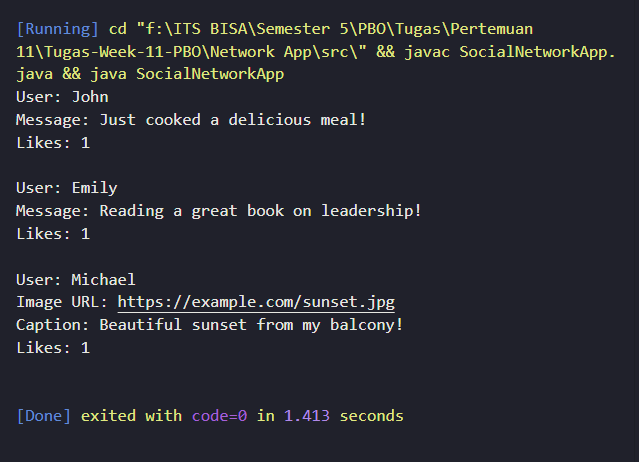

# **Tugas PBO Week 11**

**Nama** : Adyuta Prajahita Murdianto

**NRP** : 5025221186

**Kelas** : PBO A

## **Class SocialNetworkApp**

```java
public class SocialNetworkApp {
    public static void main(String[] args) {
        Network network = new Network();

        User john = new User("John");
        User emily = new User("Emily");
        User michael = new User("Michael");

        network.addUser(john);
        network.addUser(emily);
        network.addUser(michael);

        MessagePost johnMessage = new MessagePost("John", "Just cooked a delicious meal!");
        MessagePost emilyMessage = new MessagePost("Emily", "Reading a great book on leadership!");

        PhotoPost michaelPhoto = new PhotoPost("Michael", "https://example.com/sunset.jpg",
                "Beautiful sunset from my balcony!");

        john.addPost(johnMessage);
        emily.addPost(emilyMessage);
        michael.addPost(michaelPhoto);

        network.addPost(johnMessage);
        network.addPost(emilyMessage);
        network.addPost(michaelPhoto);

        emily.likePost(johnMessage);
        michael.likePost(emilyMessage);
        john.likePost(michaelPhoto);

        network.displayPosts();
    }
}
```

Kelas utama yang menjalankan program. Kelas ini bertanggung jawab untuk
menginisialisasi objek-objek User, Post, dan Network serta mengatur alur dasar aplikasi media sosial.

## **Class User**

```java
import java.util.ArrayList;
import java.util.List;

public class User {
  private String username;
  private List<Post> posts;
  private List<Post> likedPosts;

  public User(String username) {
    this.username = username;
    this.posts = new ArrayList<>();
    this.likedPosts = new ArrayList<>();
  }

  public String getUsername() {
    return username;
  }

  public void addPost(Post post) {
    posts.add(post);
  }

  public void likePost(Post post) {
    likedPosts.add(post);
    post.addLike();
  }

  public List<Post> getPosts() {
    return posts;
  }

  public List<Post> getLikedPosts() {
    return likedPosts;
  }
}
```

Kelas ini merepresentasikan pengguna dalam jejaring sosial. Setiap pengguna memiliki daftar postingan yang mereka buat dan daftar postingan yang mereka sukai.

### **Attribute**

**username**

Menyimpan nama pengguna yang unik dalam jejaring sosial. Digunakan untuk mengidentifikasi pemilik postingan dan aktivitas lainnya.

**posts**

Daftar postingan yang dibuat oleh pengguna. Setiap pengguna dapat memiliki banyak postingan yang disimpan dalam daftar ini.

**likedPosts**

Daftar postingan yang telah disukai oleh pengguna. Menyimpan referensi ke postingan yang pernah diberi tanda suka oleh pengguna.

### **Function**

**User**

Konstruktor yang digunakan untuk membuat objek User baru. Menerima username sebagai parameter dan menginisialisasi daftar posts dan likedPosts sebagai array kosong.

**getUsername**

Mengembalikan username dari pengguna. Berguna untuk menampilkan atau memproses data pengguna.

**addPost**

Menambahkan objek Post ke daftar posts milik pengguna. Metode ini digunakan saat pengguna membuat postingan baru.

**likePost**

Menambahkan postingan ke daftar likedPosts dan menambahkan jumlah suka pada postingan tersebut dengan memanggil metode addLike() dari kelas Post.

**getPosts**

Mengembalikan daftar posts milik pengguna. Berguna untuk menampilkan semua postingan yang dibuat oleh pengguna.

**getLikedPosts**

Mengembalikan daftar likedPosts, yaitu postingan yang telah disukai oleh pengguna.

## **Class Post**

```java
public abstract class Post {
  private String username;
  private int likes;

  public Post(String username) {
    this.username = username;
    this.likes = 0;
  }

  public String getUsername() {
    return username;
  }

  public int getLikes() {
    return likes;
  }

  public void addLike() {
    likes++;
  }

  public abstract void display();
}
```

Kelas abstrak yang menjadi dasar bagi semua jenis postingan. Kelas ini memiliki atribut umum seperti username dan likes.

### **Attribute**

**username**

Menyimpan nama pengguna yang membuat postingan. Digunakan untuk menampilkan siapa yang memposting konten tersebut.

**likes**

Menyimpan jumlah suka pada postingan. Diinisialisasi dengan nilai 0 dan bertambah setiap kali metode addLike() dipanggil.

### **Function**

**Post**

Konstruktor yang menginisialisasi nama pengguna yang membuat postingan dan jumlah suka awal (diatur ke 0).

**getUsername**

Mengembalikan username yang membuat postingan. Memungkinkan identifikasi pemilik postingan.

**getLikes**

Mengembalikan jumlah likes yang ada pada postingan. Berguna untuk menampilkan popularitas postingan.

**addLike**

Menambahkan satu ke jumlah likes. Dipanggil setiap kali pengguna lain menyukai postingan.

**display**

Metode abstrak yang harus diimplementasikan oleh subclass untuk menampilkan konten postingan. Menyediakan fleksibilitas untuk menampilkan jenis postingan yang berbeda.

## **Class PhotoPost**

```java
public class PhotoPost extends Post {
  private String imageUrl;
  private String caption;

  public PhotoPost(String username, String imageUrl, String caption) {
    super(username);
    this.imageUrl = imageUrl;
    this.caption = caption;
  }

  public String getImageUrl() {
    return imageUrl;
  }

  public String getCaption() {
    return caption;
  }

  @Override
  public void display() {
    System.out.println("User: " + getUsername());
    System.out.println("Image URL: " + imageUrl);
    System.out.println("Caption: " + caption);
    System.out.println("Likes: " + getLikes());
  }
}
```

Kelas yang merepresentasikan postingan foto. Subclass dari Post.

### **Attribute**

**imageUrl**

Menyimpan URL dari gambar yang diunggah dalam postingan. Berguna untuk menampilkan gambar dari sumber eksternal.

**caption**

Menyimpan keterangan gambar. Memberikan deskripsi atau informasi tambahan tentang gambar.

### **Function**

**PhotoPost**

Konstruktor yang memanggil konstruktor superclass (Post) dan menginisialisasi imageUrl dan caption.

**getImageUrl**

Mengembalikan imageUrl. Berguna untuk menampilkan atau memproses tautan gambar.

**getCaption**

Mengembalikan caption. Berguna untuk menampilkan keterangan gambar.

**display**

Implementasi metode abstrak display() dari Post. Menampilkan nama pengguna, imageUrl, caption, dan jumlah suka.

## **Class MessagePost**

```java
public class MessagePost extends Post {
  private String message;

  public MessagePost(String username, String message) {
    super(username);
    this.message = message;
  }

  public String getMessage() {
    return message;
  }

  @Override
  public void display() {
    System.out.println("User: " + getUsername());
    System.out.println("Message: " + message);
    System.out.println("Likes: " + getLikes());
  }
}
```

Kelas yang merepresentasikan postingan pesan teks. Subclass dari Post.

### **Attribute**

**message**

Menyimpan konten pesan dari postingan. Digunakan untuk menampilkan teks postingan.

### **Function**

**MessagePost**

Konstruktor yang memanggil konstruktor superclass (Post) dan menginisialisasi message dengan konten pesan yang diberikan.

**getMessage**

Mengembalikan message yang ada di postingan. Berguna untuk menampilkan atau memproses konten teks postingan.

**display**

Implementasi metode abstrak display() dari Post. Menampilkan nama pengguna, konten message, dan jumlah suka.

## **Class Network**

```java
import java.util.ArrayList;
import java.util.List;

public class Network {
  private List<User> users;
  private List<Post> posts;

  public Network() {
    this.users = new ArrayList<>();
    this.posts = new ArrayList<>();
  }

  public void addUser(User user) {
    users.add(user);
  }

  public void addPost(Post post) {
    posts.add(post);
  }

  public List<User> getUsers() {
    return users;
  }

  public List<Post> getPosts() {
    return posts;
  }

  public void displayPosts() {
    for (Post post : posts) {
      post.display();
      System.out.println();
    }
  }
}
```

Kelas yang merepresentasikan jaringan sosial yang menyimpan daftar pengguna dan postingan.

### **Attribute**

**users**

Menyimpan daftar semua pengguna yang terdaftar di jejaring sosial. Berguna untuk melacak pengguna dan memungkinkan interaksi di antara mereka.

**posts**

Menyimpan daftar semua postingan yang dibuat oleh pengguna. Digunakan untuk menampilkan dan mengelola semua konten di jaringan.

### **Function**

**Network**

Konstruktor yang menginisialisasi daftar users dan posts sebagai array kosong.

**addUser**

Menambahkan objek User ke daftar users. Digunakan saat pengguna baru bergabung dengan jaringan.

**addPost**

Menambahkan objek Post ke daftar posts. Digunakan untuk menambahkan postingan baru ke jaringan.

**getUsers**

Mengembalikan daftar semua users di jaringan. Berguna untuk menampilkan semua pengguna yang terdaftar.

**getPosts**

Mengembalikan daftar semua posts di jaringan. Berguna untuk menampilkan semua konten yang tersedia.

**displayPosts**

Menampilkan semua postingan di jaringan dengan memanggil metode display() dari setiap objek Post. Berguna untuk melihat konten yang dibuat oleh pengguna, termasuk jumlah suka.

## **Hasil**

